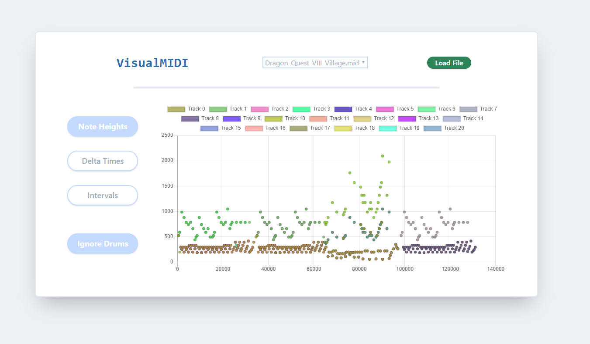

# VisualMIDI

### Overview

I am working on computer generated music and wanted to have a visualizer for midi files.
This web app allows to easily import a midi and vizualize the following:

- Scatterplot of (Time, Frequency) of midi note_on events
- BarChart of ticks between note_on events
- BarChart of intervals between note_on events

Can also toggle to include Drums track or not



Notes: it's a WIP. Chords have been filtered out

### Dependencies

Python:
- mido
- MidiStructurer (my repo: https://github.com/Wally869/MidiStructurer)

Javascript:
- Express
- Chart.js

### Plot Colors

There is no set colors for the plots.
Colors are chosen at random when needed by the ColorPool in jsfiles/frontside.js

If you want to specify your own color set, override the colors attribute of the ColorPool class

```javascript
class ColorPool {
  constructor() {
    this.colors = [];
  }
  getColor(id) {
    while (id > this.colors.length - 1) {
      this.colors.push(randomColorString());
    }
    return this.colors[id];
  }
}
```

### Improvements

wip